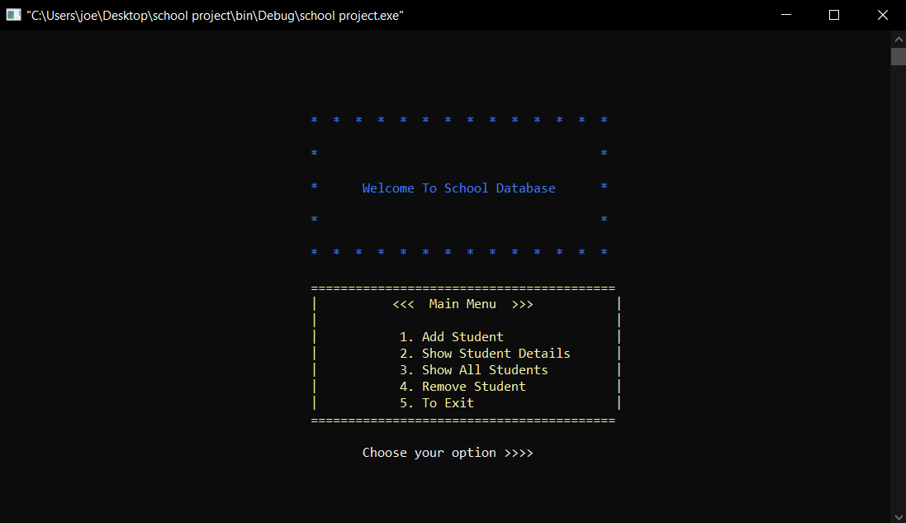

# School Database Management Project In C Language

## Author: Yousef Ayman

### **Project Description**

The School Database Management System project in C Language is a consoled based application created using c programming language. This system is a simple mini project and compiled in **Code::Blocks IDE** using GCC compiler. It makes use of file management and demonstrates how to use the programming language’s classes and objects effectively. The project is built on the concept of the data structure such as linked list.

### **User Interfacing Options**
The user can take the following action in this project through the console: 
- Adding student 
- Removing student 
- Editing the student info
- Printing the list

### **How to run the project**
1. Open CodeBlocks IDE
2. Open With File **school project.cbp**

